# aggregator

The worldwide BMLT server aggregator (formerly tomato) uses the [BMLT Server](https://github.com/bmlt-enabled/bmlt-server) codebase. This repo contains the terraform for the aggregator infrastructure and the worldwide servers list [serverList.json](./serverList.json).

## Architecture

```mermaid
graph TB
    subgraph "Root Servers Worldwide"
        RS1["🌍 Aotearoa NZ<br/>bmlt.nzna.org"]
        RS2["🌍 Greater NY<br/>bmlt.newyorkna.org"]
        RS3["🌍 40+ other servers<br/>..."]
    end

    subgraph "AWS Infrastructure"
        subgraph "ECS Cluster (EC2: t3a.small x2)"
            INIT["⚙️ aggregator-init<br/>(Database Setup)"]
            APP1["🚀 aggregator<br/>Task 1<br/>Port 8000"]
            APP2["🚀 aggregator<br/>Task 2<br/>Port 8000"]
            IMPORT["📥 aggregator-import<br/>(Scheduled: Every 4hrs)"]
        end
        
        ALB["⚖️ Application Load Balancer"]
        RDS["🗄️ RDS MySQL 8<br/>db.t3.micro<br/>100GB"]
        CW["📊 CloudWatch<br/>Logs & Alarms"]
        LAMBDA["λ Lambda Monitor<br/>(Task Failures)"]
        SNS["📧 SNS Alerts"]
    end

    subgraph "Public Access"
        DNS1["🌐 aggregator.bmltenabled.org"]
    end

    RS1 -->|"Fetch Meetings"| IMPORT
    RS2 -->|"Fetch Meetings"| IMPORT
    RS3 -->|"Fetch Meetings"| IMPORT
    
    IMPORT -->|"Store Data"| RDS
    INIT -->|"Initialize Schema"| RDS
    APP1 -->|"Query"| RDS
    APP2 -->|"Query"| RDS
    
    DNS1 --> ALB
    ALB -->|"Route Traffic"| APP1
    ALB -->|"Route Traffic"| APP2
    
    APP1 -.->|"Logs"| CW
    APP2 -.->|"Logs"| CW
    IMPORT -.->|"Logs"| CW
    INIT -.->|"Logs"| CW
    
    CW -->|"Task Stopped Events"| LAMBDA
    CW -->|"Health Alerts"| SNS
    LAMBDA --> SNS

    style IMPORT fill:#ffb3b3,stroke:#333,stroke-width:2px,color:#000
    style APP1 fill:#b3d9ff,stroke:#333,stroke-width:2px,color:#000
    style APP2 fill:#b3d9ff,stroke:#333,stroke-width:2px,color:#000
    style INIT fill:#ffe6b3,stroke:#333,stroke-width:2px,color:#000
    style RDS fill:#b3ffb3,stroke:#333,stroke-width:2px,color:#000
```

